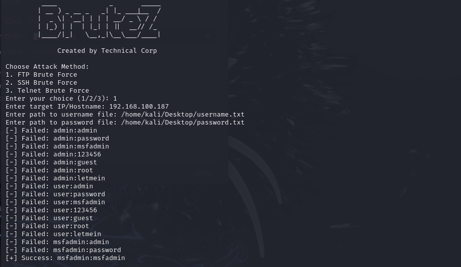

# BruteZ - Multi-Service Brute Force Tool



## Introduction
BruteZ is a multi-service brute-force tool designed for ethical penetration testing. It supports brute-forcing the following services:
- **FTP**
- **SSH**
- **Telnet**

This tool is ideal for cybersecurity professionals, ethical hackers, and learners looking to practice or test password security in a controlled environment.

### Key Features:
- Easy-to-use menu-driven interface.
- Supports user-defined username and password files.
- Modular code structure for future extensions.
- Displays real-time success or failure feedback.

## Installation

### Prerequisites:
- Python 3.7 or higher.
- `pip` (Python package manager).

### Steps:
1. Clone the repository:
   ```bash
   git clone https://github.com/techcorp/brutz.git
   cd brutz
2. Install the required dependencies:
   ```bash
   pip install -r requirements.txt
   ```
3. Run the tool:
   ```bash
   python brutz.py
   ```

### Usage
**Prepare Username and Password Files:**

Create a plain text file for usernames and passwords, each entry on a new line. Example:
usernames.txt:
```
root
guest
passwords.txt:
Copy code
password
123456
admin123
```
**Start the Tool:**
Run the script:
```
python3 brutez.py
```
**Select Attack Method:**
Choose the target service (FTP, SSH, or Telnet) and provide the required inputs:
```
Target IP/Hostname.
Paths to username and password files.
```
**View Results:**
The tool will display successful username-password combinations upon discovery.

### Disclaimer
This tool is for educational purposes only. Use it exclusively on systems you own or have explicit permission to test. Unauthorized use is illegal and punishable by law.

Contact
Author: Technical Corp
GitHub: [TechnicalCorp](https://github.com/techcorp/)
YouTube: [Technical Corp](https://youtube.com/@technicalcorp)
